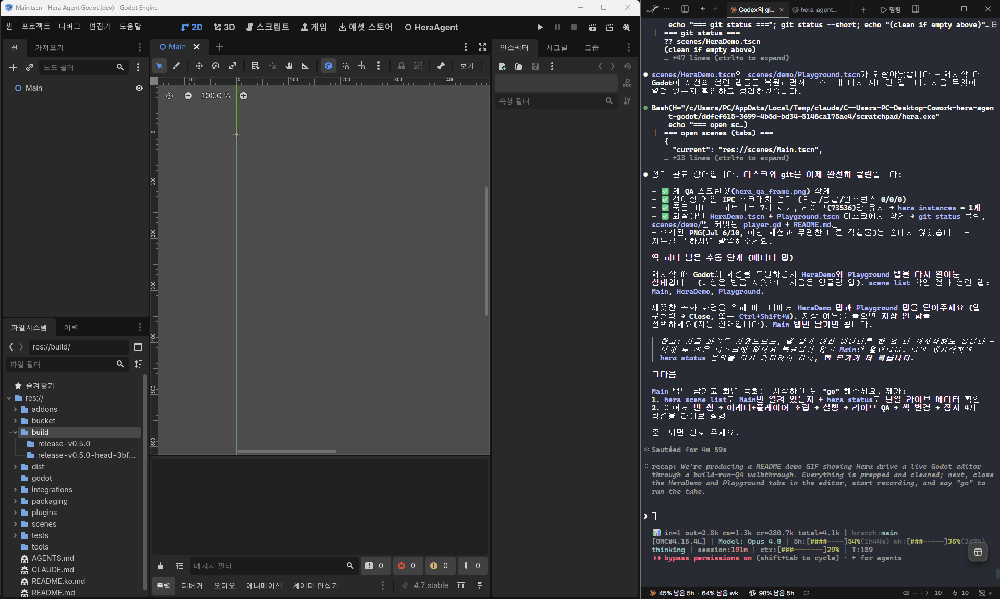

<p align="center">
  
</p>

# hera-agent-godot

[English](README.md) · **한국어**

> Hera gives agents eyes, hands, and proof in the live Godot editor.

<p align="center">
  
</p>
<p align="center">
  <em>셸만으로 라이브 Godot 게임을 조립·실행·QA했습니다 — 씬 조립 → 실행 → 움직이는 플레이어 읽기 → 입력 주입 후 반응 검증 → 실행 중 노드 색 변경. 전체 세션의 도구 출력이 <strong>약 1,170토큰</strong>입니다: 기본이 컴팩트 JSON, 스키마 프리로드 없음.</em>
</p>

AI 코딩 에이전트가 **실행 중인 Godot 4.7+ 에디터**를 실시간으로 검사·제어하게 해주는
**저토큰(low-token) CLI**입니다 — 출력/에러 읽기, 씬 실행, 노드 트리 탐색·편집,
GDScript 평가 등. 에이전트가 낡은 학습 데이터로 추측하는 대신 *실제* 에디터에
직접 작용하고 결과를 확인합니다.

**왜 MCP가 아니라 CLI인가?** Godot에는 이미 MCP 애드온 생태계가 활발합니다 —
헤라는 일부러 그 반대에 베팅합니다. MCP 서버는 폭을 토큰으로 지불합니다: 수십~100개+의
도구 스키마와 장황한 JSON 응답이 **매 턴** 에이전트 컨텍스트에 얹힙니다. 헤라는
**MCP급의 에디터 제어 범위를 compact-JSON 기본의 CLI로** 제공합니다 — 액션당 한 명령,
최소 토큰, 그리고 MCP 클라이언트만이 아니라 **셸 명령을 실행할 수 있는 무엇과도**
동작합니다(파이프, `batch`, CI, 어떤 에이전트든).

헤라의 제품 아이덴티티는 간단합니다: **라이브 에디터 진실, 저토큰 제어,
증거 우선 QA**. 새 기능의 언어와 설계 원칙은
[docs/IDENTITY.md](docs/IDENTITY.md)에 정리되어 있습니다.

[`hera-agent-unity`](https://github.com/NotNull92/hera-agent-unity)의 자매
프로젝트로, 동일한 저토큰·쉘 친화 철학을 따르며 **포팅이 아니라 Godot에 맞춰
새로 설계**했습니다.

## 현재 릴리스 기준: v0.9.0

`v0.9.0`은 현재 저장소 태그와 애드온 매니페스트 기준 버전입니다. v0.8.0 토대
(Godot 4.2–4.7 지원, 출력 계약, 옵트인 공유 토큰 인증) 위에서 **리치(reach)**에
집중합니다: 에이전트가 도구를 고르는 곳에 Hera를 두고, 라이브 세션을 쉽게
증명할 수 있게 만드는 것입니다.

주요 변경 사항:

- **에이전트 측 배포**:
  [`hera-godot` npm 래퍼](https://www.npmjs.com/package/hera-godot),
  Homebrew tap, 저장소 내 Scoop 버킷으로 CLI를 설치하고, 하나의 자동 호출
  ~1k 토큰 `live-editor` 스킬을 공유하는 Claude Code·Codex 플러그인과 Cursor
  규칙으로 에이전트에 Hera를 붙일 수 있습니다
  ([integrations/](integrations/), [plugins/](plugins/)).
- **에러 메시지 값-문법 힌트**: `node set`, `game node set`, `resource set`
  값을 파싱하지 못하면 이제 기대하는 Godot variant 텍스트를 알려줍니다
  (예: `Vector2(x, y)`, 평탄한 `PackedVector2Array(...)`, 객체 속성이면
  `node set-resource`) — 조용히 실패하지 않습니다.
- **더 안정적인 런타임 QA**: `game qa` 라이프사이클 대기·타임아웃을 안정화해
  실행 → 검사 → QA → 정지 흐름이 CI에서도 안정적입니다.
- **복사 가능한 비시각 CI 티어**: 고정된 Godot 4.7 헤드리스 라이프사이클
  (활성 에디터 → `smoke` → `game qa` 런타임 로직)과 4.2/4.7 정적 스크립트
  게이트 ([docs/HEADLESS_CI.md](docs/HEADLESS_CI.md)).
- **라이브 데모**: 이 README 상단에 실제 에디터에서 빌드 → 실행 → QA 전체
  세션을 약 1,170 토큰의 도구 출력으로 녹화해 실었습니다.

릴리스 노트와 Asset Store 패키징 세부 사항:
[docs/releases/v0.9.0-asset-store-upload.md](docs/releases/v0.9.0-asset-store-upload.md).

## 헤드리스 CI(구성된 티어)

[헤드리스 CI 레시피](docs/HEADLESS_CI.md)는 **Godot 4.7 전용** 비시각 런타임
수명주기를 정의합니다. 애드온을 켠 헤드리스 에디터를 시작하고, 새 heartbeat와
`smoke --skip-game`을 확인한 뒤 결정적인 런타임 로직 시나리오를 실행합니다.
스크린샷, 시각 UI, 렌더러 출력, 창/입력 동작은 이 티어의 범위 밖이며 Godot
4.2–4.6까지 라이브 런타임 지원을 넓히지 않습니다.

이 티어는 구성되었지만 **GitHub Actions 원격 검증은 아직 대기 중**입니다. 실제로
권한을 받아 실행한 GitHub Actions가 성공하기 전까지 이 레시피는 원격 런타임 지원의
증거가 아닙니다.

## 저토큰, 실측

"MCP급 범위, 더 적은 토큰" 주장을 수치로:

| | 헤라 (CLI) | Godot MCP 서버 (도구 약 41~155개) |
|---|---|---|
| **매 턴** 상주하는 도구 스키마 | **0** | ~4k~31k tok (도구 수에 비례 증가) |
| 에이전트가 로드하는 표면 | 문서 1개, ~1.0k tok — 캐시 가능·평탄 | 전체 도구 목록, 매 턴 재전송 |
| 액션당 응답 | compact JSON — `status` ≈48 tok, `node get` ≈186 tok | JSON, 보통 pretty |

헤라 수치는 라이브 Godot 4.7 에디터에서 **실측**, MCP 열은 공개 Godot MCP
서버들의 표본 도구 수(약 41~155개) × 도구 스키마당 ~100~200 tok 으로 낸
**추정**입니다. 방법론·한계·재현법:
**[docs/LOW_TOKEN.md](docs/LOW_TOKEN.md)**.

## 명령 표면

`v0.9.0` CLI/애드온 표면에는 다음 명령이 포함됩니다:
`status`, `instances`, `run`/`stop`, `scene`, `editor`, `script`, `project`, `classdb`,
`node`(읽기+쓰기+리소스/스크립트 연결), `signal`,
`resource`(get/uid/list/set/create/resave/update-uids/export-mesh-library),
`theme`(Theme 리소스 항목 get/set),
`game`(런타임 검사+input+input-log+set/call/click+assert+QA+screenshot),
`guidance`, `game_feel`, `output`, `diagnostics`, `eval`, `screenshot`(캡처 +
로컬 before/after `diff`), `batch`,
`smoke` + `--json`/`--ids` 출력 모드. 명령 레퍼런스는
[docs/COMMANDS.md](docs/COMMANDS.md), 릴리스와 Asset Store 패키징 상태는
[docs/ROADMAP.md](docs/ROADMAP.md)에서 확인하세요.

## 설치

**CLI** — 패키지 매니저로 설치:

```powershell
# Windows (Scoop)
scoop bucket add hera-agent-godot https://github.com/NotNull92/hera-agent-godot
scoop install hera
```

```sh
# macOS / Linux (Homebrew)
brew install NotNull92/hera/hera
```

```sh
# Node.js 18+ 이 있는 모든 플랫폼 (npm)
npm install -g hera-godot
# 또는 설치 없이 실행: npx hera-godot status
```

또는 최신 릴리스 바이너리를 받아 설치하는 원라인:

```sh
# macOS / Linux
curl -fsSL https://raw.githubusercontent.com/NotNull92/hera-agent-godot/main/install.sh | sh
```

```powershell
# Windows (PowerShell)
irm https://raw.githubusercontent.com/NotNull92/hera-agent-godot/main/install.ps1 | iex
```

특정 태그는 `HERA_VERSION`, 설치 경로는 `HERA_BIN_DIR`로 지정할 수 있습니다.
소스 빌드는 `go build -o hera .` (Go 1.25+). `hera version`으로 확인하세요.
Windows winget 배포는 의도적으로 폐기했습니다. winget-pkgs 제출은 한 번도 하지
않았으며 앞으로도 계획하지 않습니다. 결정 기록은
[`packaging/README.md`](packaging/README.md)를 확인하세요.

**애드온** — [최신 릴리스](https://github.com/NotNull92/hera-agent-godot/releases/latest)에서
`hera-agent-godot-addon.zip`을 받아 Godot 프로젝트 루트에 풀면(`addons/hera_agent_godot/` 생성)
**프로젝트 → 프로젝트 설정 → 플러그인**에서 활성화할 수 있습니다.

## 에이전트 통합

각 킷은 큰 도구 스키마 대신 에이전트에 작은 Hera 워크플로 하나를 제공합니다. 먼저
CLI를 설치하고 애드온을 활성화하세요.

- **Claude Code:** Claude Code 안에서 이 저장소를 마켓플레이스로 추가한 뒤
  플러그인을 설치합니다.

  ```text
  /plugin marketplace add NotNull92/hera-agent-godot
  /plugin install hera-godot@hera-agent-godot
  /reload-plugins
  ```

  `live-editor` 스킬은 Godot 에디터 작업에서 자동 호출되며, 필요하면
  `/hera-godot:live-editor`로 직접 호출할 수 있습니다. 마켓플레이스를 추가하지
  않고 로컬 체크아웃을 시험하려면
  `claude --plugin-dir ./integrations/claude-code/hera-godot`를 실행하세요.
- **Codex:** 터미널에서 이 저장소를 Codex 플러그인 마켓플레이스로 추가한 뒤
  플러그인을 설치합니다.

  ```text
  codex plugin marketplace add NotNull92/hera-agent-godot
  codex plugin add hera-godot@hera-agent-godot
  ```

  번들된 `live-editor` 스킬은 Godot 에디터 작업에서 자동 호출됩니다. 로컬
  체크아웃을 시험하려면 `codex plugin marketplace add <체크아웃-경로>`를 실행하고,
  끝나면 `codex plugin marketplace remove hera-agent-godot`으로 제거하세요.
- **Cursor:**
  [`integrations/cursor/hera-godot.mdc`](integrations/cursor/hera-godot.mdc)를
  `<your-project>/.cursor/rules/hera-godot.mdc`로 복사하세요. 라이브 Godot 작업에
  관련될 때 Cursor가 로드하는 Agent Requested 프로젝트 규칙입니다.
- **기타 코딩 에이전트:**
  [`integrations/AGENTS.md`](integrations/AGENTS.md)의 내용을 대상 프로젝트
  `AGENTS.md`에 추가하세요.

각 에이전트용 문서는 Hera의 저토큰 설계를 뒷받침하는 약 1k-token 이하
표면 예산을 지키며, Claude Code와 Codex는 같은 `live-editor` 스킬을 공유합니다.

## 동작 방식

```
Go CLI  ──HTTP /rpc──▶  Godot 에디터 애드온 (@tool EditorPlugin, GDScript)
 (cmd/, internal/)        (addons/hera_agent_godot/)
        ▲                          │
        └── ~/.hera-agent-godot/instances/ 스캔 ◀── Heartbeat
```

- **CLI** (Go): 에디터를 탐색하고, 명령마다 압축된 JSON 요청 하나를 보냅니다.
- **애드온** (GDScript): localhost HTTP 서버를 띄우고, 각 요청을 `EditorInterface`를 통해
  에디터 메인 스레드에서 실행합니다.

전체 설계는 **[docs/ARCHITECTURE.md](docs/ARCHITECTURE.md)**, 명령 목록은
**[docs/COMMANDS.md](docs/COMMANDS.md)**, 릴리스 이력은
**[docs/ROADMAP.md](docs/ROADMAP.md)**를 참고하세요.

## 디렉토리 구조

```
addons/hera_agent_godot/  배포용 Godot 4.7+ 애드온 (GDScript)
project.godot, scenes/    개발용 호스트 프로젝트 — CLI의 run/save/screenshot 대상
cmd/                      Go CLI 명령 (status, instances, run/stop, scene, editor, script, project, classdb, node, signal, resource, game, guidance, game_feel, output, diagnostics, eval, screenshot, batch, smoke)
internal/                 client / discovery / protocol
docs/                     ARCHITECTURE, COMMANDS, ROADMAP, 릴리스 노트, 프롬프트 게임 가이드
integrations/             간결한 Claude Code, Cursor, AGENTS.md 하네스 킷
```

## 요구 사항

- Go 1.25+ (CLI)
- Godot **4.7+** 표준 빌드 권장 (애드온). 검증된 최소 버전은 **4.2**입니다:
  4.2–4.6에서 애드온 로드와 CLI 응답을 스팟체크로 확인했습니다 —
  [docs/SUPPORT_MATRIX.md](docs/SUPPORT_MATRIX.md) 참고.

## 보안

브리지는 `127.0.0.1`에만 바인딩되고 브라우저 오리진 요청을 거부합니다.
옵트인 공유 토큰 인증(`~/.hera-agent-godot/token` 또는
`HERA_AGENT_GODOT_TOKEN`)으로 비밀을 아는 클라이언트만 허용할 수 있습니다.
위협 모델과 설정: [docs/SECURITY.md](docs/SECURITY.md).

## 자매 프로젝트: hera-agent-unity

Unity도 쓰신다면 — [**hera-agent-unity**](https://github.com/NotNull92/hera-agent-unity)는
동일한 저토큰·셸 친화 철학을 **Unity 에디터**에 적용합니다: 콘솔 에러 읽기, C# 실행,
Play Mode 진입, GameObject 관리, UI 빌드, 테스트 실행 — 전부 compact·에이전트 친화
출력으로. 두 엔진을 오가도 에이전트는 일관된 방식으로 각각을 제어합니다.

## 후원

Hera는 무료이며 MIT 라이선스입니다. 도움이 되었다면 개발을 후원하실 수 있습니다:

[디스코드 커뮤니티 참여하기](https://discord.gg/QBzEVuYwK)

[](https://ko-fi.com/notnull92)

## 라이선스

MIT — [LICENSE](LICENSE) 참고.
