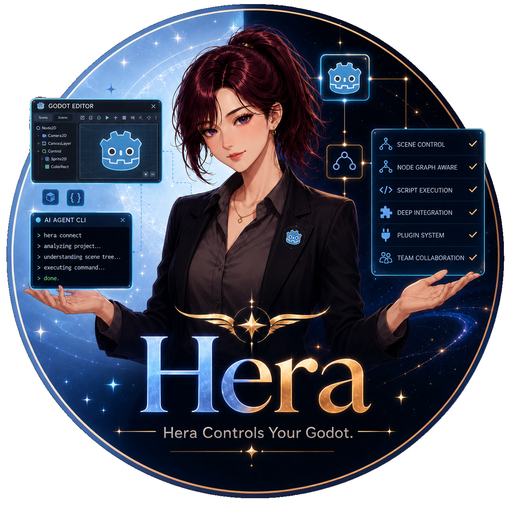

<p align="center">
  
</p>

# hera-agent-godot

**English** · [한국어](README.ko.md)

> Let's go Hera, now in Godot.

A **low-token CLI** that lets AI coding agents inspect and control a **live
Godot 4.7+ editor** in real time — read the output/errors, run a scene, walk and
edit the node tree, evaluate GDScript, and more. The agent acts on the *real*
editor and checks the result instead of guessing from stale training data.

**Why a CLI, not MCP?** Godot already has a healthy MCP-addon ecosystem — Hera
makes the opposite bet on purpose. MCP servers pay for breadth in tokens: dozens
to 100+ tool schemas plus verbose JSON responses sit in the agent's context
every turn. Hera delivers **MCP-grade reach over the live editor as a
compact-JSON-by-default CLI** — one command per action, minimal tokens, and it
works with anything that can run a shell command (pipes, `batch`, CI, any
agent), not just MCP clients.

Sibling of [`hera-agent-unity`](https://github.com/NotNull92/hera-agent-unity) —
same low-token, shell-native philosophy, **designed for Godot**, not ported.

## Low-token, measured

The "MCP-grade reach, fewer tokens" claim — with numbers:

| | Hera (CLI) | Godot MCP servers (~41–155 tools) |
|---|---|---|
| Tool schemas resident **per turn** | **0** | ~4k–31k tok (grows with tool count) |
| Surface the agent loads | one doc, ~1.0k tok — cacheable & flat | full tool list, re-sent each turn |
| Per-action response | compact JSON — `status` ≈48 tok, `node get` ≈186 tok | JSON, often pretty |

Hera figures are **measured** on a live Godot 4.7 editor; the MCP column is an
**estimate** from public tool counts (`godot-ai` ~41 MCP tools / 120+ ops,
`godot-mcp-native` 155 tools) × ~100–200 tok per tool schema. Method, caveats,
and a reproducer:
**[docs/LOW_TOKEN.md](docs/LOW_TOKEN.md)**.

## Status

**Phases 0–5 complete.** The core tool surface is implemented and reviewed:
`status`, `run`/`stop`, `scene`, `node` (read + write), `signal`, `output`,
`eval`, `screenshot`, and `batch`, with `--json`/`--ids` output modes. See
[docs/COMMANDS.md](docs/COMMANDS.md) for the command reference and
[docs/ROADMAP.md](docs/ROADMAP.md) for the remaining polish (installers / Asset
Library packaging).

## Install

**CLI** — one-liner that fetches the latest release binary:

```sh
# macOS / Linux
curl -fsSL https://raw.githubusercontent.com/NotNull92/hera-agent-godot/main/install.sh | sh
```

```powershell
# Windows (PowerShell)
irm https://raw.githubusercontent.com/NotNull92/hera-agent-godot/main/install.ps1 | iex
```

Set `HERA_VERSION` to pin a tag and `HERA_BIN_DIR` to change the target dir. Or
build from source: `go build -o hera .` (Go 1.25+). Check it with `hera version`.

**Addon** — download `hera-agent-godot-addon.zip` from the
[latest release](https://github.com/NotNull92/hera-agent-godot/releases/latest),
unzip it into your Godot project root (creating `addons/hera_agent_godot/`), and
enable it under **Project → Project Settings → Plugins**.

## How it works

```
Go CLI  ──HTTP /rpc──▶  Godot editor addon (@tool EditorPlugin, GDScript)
 (cmd/, internal/)        (godot/addons/hera_agent_godot/)
        ▲                          │
        └── scans ~/.hera-agent-godot/instances/ ◀── Heartbeat
```

- **CLI** (Go): discovers the editor, sends one compact JSON request per command.
- **Addon** (GDScript): runs a localhost HTTP server, executes each request on the
  editor main thread via `EditorInterface`.

See **[docs/ARCHITECTURE.md](docs/ARCHITECTURE.md)** for the full design,
**[docs/COMMANDS.md](docs/COMMANDS.md)** for the command surface, and
**[docs/ROADMAP.md](docs/ROADMAP.md)** for the build plan.

## Repository layout

```
cmd/         Go CLI commands (status, run/stop, scene, node, signal, output, eval, screenshot, batch)
internal/    client / discovery / protocol
godot/       dev Godot 4.7+ project + the addon (godot/addons/hera_agent_godot)
docs/        ARCHITECTURE, COMMANDS, ROADMAP
```

## Requirements (target)

- Go 1.25+ (CLI)
- Godot **4.7+** standard build (addon)

## License

MIT — see [LICENSE](LICENSE).
